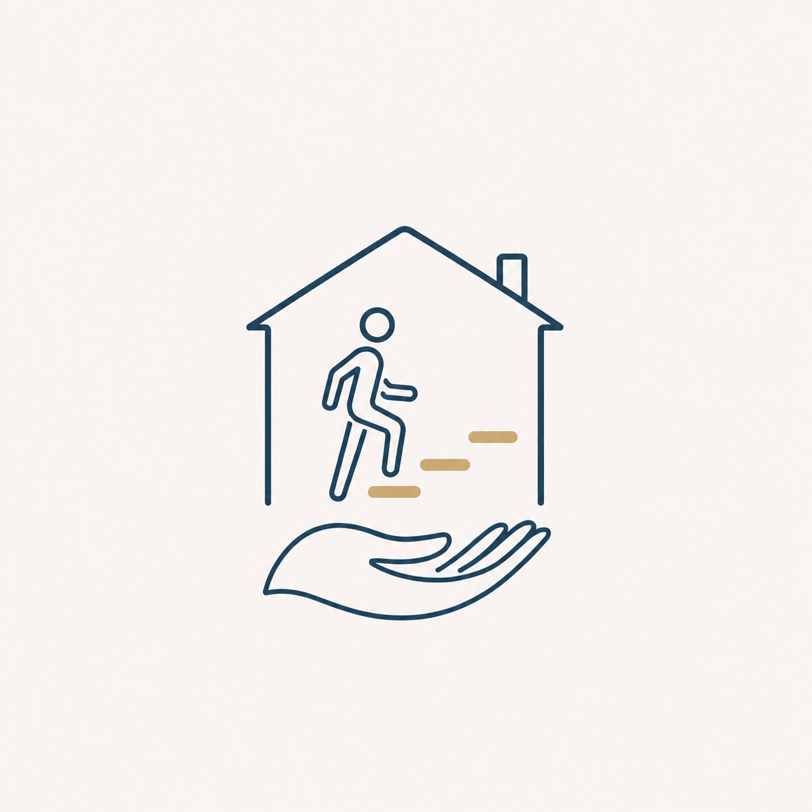

# Raster-Only Primary Logo Implementation Plan

> **For agentic workers:** REQUIRED SUB-SKILL: Use superpowers:subagent-driven-development (recommended) or superpowers:executing-plans to implement this plan task-by-task. Steps use checkbox (`- [ ]`) syntax for tracking.

**Goal:** Produce deterministic 2048-pixel and 512-pixel opaque PNG lockups that preserve the approved supplied symbol and pair it with the existing Stronger at Home Physiotherapy wordmark for Melanie Watsham's exact-pixel review.

**Architecture:** A small Pillow-based generator reads the immutable 1254 × 1254 PNG and the two committed font files, applies one fixed rectangular crop, and composes a 2048 × 640 RGB master. The 512 × 160 version is derived from that master so both exports share one layout. Existing validation is extended to enforce source integrity, PNG dimensions, opacity, manifest hashes, proposed/approved governance, and the absence of active SVG logo assets.

**Tech Stack:** Python 3, Pillow 12.3.0 already available in the workspace, `unittest`, PNG, HTML/CSS, JSON, Markdown, SHA-256 provenance.

## Global Constraints

- The immutable source is `docs/superpowers/specs/assets/home-physiotherapy-logo-approved-concept-v2.png`, exactly 1254 × 1254 RGB pixels with SHA-256 `41267865711ca55f9225df8370c50bca823f68ca966b8fc216852e65a36d0ef1`.
- Do not trace, redraw, regenerate, recolour, background-remove, sharpen, filter, AI-edit or overwrite the immutable source.
- Do not create SVG, transparent, monochrome or AI-redrawn derivatives.
- Crop only the fixed outer rectangle `(300, 285, 954, 1023)`; it retains the artwork and glow with an even pale margin.
- Use the source crop's pale perimeter median, RGB `(249, 244, 242)`, across the complete lockup canvas.
- The 2048-pixel master is exactly `2048 × 640`; the small lockup is exactly `512 × 160` and is resized from the master.
- Place the cropped symbol at `(48, 40)` after fitting it inside `520 × 560` without changing its aspect ratio.
- Place the wordmark to the right at `x=640`: `Stronger at Home` at `y=130`, `Physiotherapy` at `y=270`, and `by Melanie Watsham` at `y=390`.
- Use Source Serif 4 at 112 px and 82 px for the two wordmark lines; use Atkinson Hyperlegible Next at 44 px for the endorsement.
- Render all wordmark text in Deep Navy `#203E55`, RGB `(32, 62, 85)`.
- Save both exports as opaque RGB PNG files with `compress_level=9`; the only resampling is Lanczos scaling required for placement and the smaller export.
- Keep `Stronger at Home Physiotherapy` proposed pending name clearance. Keep HCPC, CSP, AGILE and ATOCP wording verification-gated.
- Keep both exact output files proposed until Melanie Watsham explicitly approves them and an ISO review date is recorded.
- Retain the existing SVG as deprecated historical evidence; do not delete it and do not treat it as an active production asset.
- Preserve `sources/` and the parent checkout's staged `AGENTS.md`.
- Do not install, push, deploy or publish anything while implementing this plan.
- Use path-scoped staging and focused commits after every task.

## File Map

| File | Responsibility |
|---|---|
| `scripts/generate_raster_logo.py` | Deterministically composes the master and small raster lockups from the immutable PNG and committed fonts |
| `tests/test_raster_logo_generation.py` | Verifies source protection, fixed geometry, opacity, dimensions and deterministic output |
| `brand/assets/source/logo-primary-raster-2048.png` | Proposed full-size opaque primary lockup |
| `brand/assets/source/logo-primary-raster-512.png` | Proposed small opaque primary lockup derived from the master |
| `scripts/validate_brand.py` | Enforces raster production requirements, hashes and approval governance |
| `tests/test_brand_validation.py` | Exercises manifest, raster metadata, source-hash and active-SVG rejection paths |
| `brand/assets/manifest.json` | Records deprecated SVG and both proposed raster outputs with real SHA-256 values |
| `brand/assets/review/logo-raster-preview.html` | Presents source, 2048-pixel output and 512-pixel output for exact visual review |
| `brand/assets/review/logo-hybrid-preview.html` | Marks the previous SVG comparison as historical and deprecated |
| `BRAND.md` | Points adopters to the current raster-only proposed artwork boundary |
| `DECISIONS.md` | Deprecates the vector cleanup and records approved raster direction plus proposed exact pixels |
| `MEMORY.md` | Records why the source PNG is preserved and why final approval remains gated |
| `brand/identity.md` | Defines the current raster-only architecture and prohibited variants |
| `brand/clearance.md` | Adds the exact v2 source rights gate and exact-pixel approval gate |

---

### Task 1: Generate deterministic opaque raster lockups

**Files:**
- Create: `scripts/generate_raster_logo.py`
- Create: `tests/test_raster_logo_generation.py`
- Create: `brand/assets/source/logo-primary-raster-2048.png`
- Create: `brand/assets/source/logo-primary-raster-512.png`

**Interfaces:**
- Consumes: immutable source PNG; `brand/fonts/source-serif-4.ttf`; `brand/fonts/atkinson-hyperlegible-next.ttf`.
- Produces: `render_master(root: Path) -> Image.Image`, `generate(root: Path) -> tuple[Path, Path]`, and the two exact RGB PNG files used by Tasks 2 and 3.

- [ ] **Step 1: Write the generator contract tests**

Create `tests/test_raster_logo_generation.py` with these tests:

```python
import hashlib
from pathlib import Path
from tempfile import TemporaryDirectory
import unittest

from PIL import Image

from scripts.generate_raster_logo import (
    MASTER_SIZE,
    SMALL_SIZE,
    SOURCE_SHA256,
    generate,
)


PROJECT_ROOT = Path(__file__).resolve().parents[1]


class RasterLogoGenerationTests(unittest.TestCase):
    def test_immutable_source_matches_approved_hash(self):
        source = PROJECT_ROOT / (
            "docs/superpowers/specs/assets/"
            "home-physiotherapy-logo-approved-concept-v2.png"
        )
        self.assertEqual(
            hashlib.sha256(source.read_bytes()).hexdigest(), SOURCE_SHA256
        )

    def test_generate_writes_exact_opaque_dimensions(self):
        with TemporaryDirectory() as directory:
            root = Path(directory)
            self._copy_inputs(root)
            master_path, small_path = generate(root)
            with Image.open(master_path) as master:
                self.assertEqual(master.size, MASTER_SIZE)
                self.assertEqual(master.mode, "RGB")
                self.assertEqual(master.format, "PNG")
            with Image.open(small_path) as small:
                self.assertEqual(small.size, SMALL_SIZE)
                self.assertEqual(small.mode, "RGB")
                self.assertEqual(small.format, "PNG")

    def test_generate_is_byte_deterministic(self):
        with TemporaryDirectory() as directory:
            root = Path(directory)
            self._copy_inputs(root)
            first_paths = generate(root)
            first_hashes = [
                hashlib.sha256(path.read_bytes()).hexdigest()
                for path in first_paths
            ]
            second_paths = generate(root)
            second_hashes = [
                hashlib.sha256(path.read_bytes()).hexdigest()
                for path in second_paths
            ]
        self.assertEqual(first_hashes, second_hashes)

    def _copy_inputs(self, root: Path) -> None:
        relative_inputs = (
            "docs/superpowers/specs/assets/"
            "home-physiotherapy-logo-approved-concept-v2.png",
            "brand/fonts/source-serif-4.ttf",
            "brand/fonts/atkinson-hyperlegible-next.ttf",
        )
        for relative in relative_inputs:
            source = PROJECT_ROOT / relative
            destination = root / relative
            destination.parent.mkdir(parents=True, exist_ok=True)
            destination.write_bytes(source.read_bytes())
```

- [ ] **Step 2: Run the focused tests and confirm RED**

Run:

```bash
python3 -m unittest tests.test_raster_logo_generation -v
```

Expected: import failure for `scripts.generate_raster_logo` because the generator does not exist.

- [ ] **Step 3: Implement the deterministic generator**

Create `scripts/generate_raster_logo.py` with this complete implementation:

```python
from __future__ import annotations

import hashlib
from pathlib import Path

from PIL import Image, ImageDraw, ImageFont


SOURCE_RELATIVE = Path(
    "docs/superpowers/specs/assets/"
    "home-physiotherapy-logo-approved-concept-v2.png"
)
SOURCE_SHA256 = (
    "41267865711ca55f9225df8370c50bca823f68ca966b8fc216852e65a36d0ef1"
)
SOURCE_SIZE = (1254, 1254)
CROP_BOX = (300, 285, 954, 1023)
MASTER_SIZE = (2048, 640)
SMALL_SIZE = (512, 160)
SYMBOL_FIT = (520, 560)
SYMBOL_POSITION = (48, 40)
BACKGROUND = (249, 244, 242)
DEEP_NAVY = (32, 62, 85)
SOURCE_SERIF = Path("brand/fonts/source-serif-4.ttf")
ATKINSON = Path("brand/fonts/atkinson-hyperlegible-next.ttf")
MASTER_OUTPUT = Path("brand/assets/source/logo-primary-raster-2048.png")
SMALL_OUTPUT = Path("brand/assets/source/logo-primary-raster-512.png")


def _verified_source(root: Path) -> Image.Image:
    path = root / SOURCE_RELATIVE
    actual_hash = hashlib.sha256(path.read_bytes()).hexdigest()
    if actual_hash != SOURCE_SHA256:
        raise ValueError(
            f"Immutable source hash mismatch: expected {SOURCE_SHA256}, "
            f"received {actual_hash}"
        )
    image = Image.open(path)
    image.load()
    if image.size != SOURCE_SIZE or image.mode != "RGB":
        raise ValueError(
            f"Immutable source must be RGB {SOURCE_SIZE[0]} × {SOURCE_SIZE[1]}"
        )
    return image


def render_master(root: Path) -> Image.Image:
    source = _verified_source(root)
    symbol = source.crop(CROP_BOX)
    symbol.thumbnail(SYMBOL_FIT, Image.Resampling.LANCZOS)

    canvas = Image.new("RGB", MASTER_SIZE, BACKGROUND)
    canvas.paste(symbol, SYMBOL_POSITION)
    draw = ImageDraw.Draw(canvas)
    source_serif_primary = ImageFont.truetype(root / SOURCE_SERIF, 112)
    source_serif_descriptor = ImageFont.truetype(root / SOURCE_SERIF, 82)
    atkinson_endorsement = ImageFont.truetype(root / ATKINSON, 44)
    draw.text(
        (640, 130),
        "Stronger at Home",
        font=source_serif_primary,
        fill=DEEP_NAVY,
        anchor="lt",
    )
    draw.text(
        (640, 270),
        "Physiotherapy",
        font=source_serif_descriptor,
        fill=DEEP_NAVY,
        anchor="lt",
    )
    draw.text(
        (640, 390),
        "by Melanie Watsham",
        font=atkinson_endorsement,
        fill=DEEP_NAVY,
        anchor="lt",
    )
    return canvas


def _save_png(image: Image.Image, path: Path) -> None:
    path.parent.mkdir(parents=True, exist_ok=True)
    image.save(path, format="PNG", optimize=False, compress_level=9)


def generate(root: Path) -> tuple[Path, Path]:
    master = render_master(root)
    small = master.resize(SMALL_SIZE, Image.Resampling.LANCZOS)
    master_path = root / MASTER_OUTPUT
    small_path = root / SMALL_OUTPUT
    _save_png(master, master_path)
    _save_png(small, small_path)
    return master_path, small_path


def main() -> None:
    master_path, small_path = generate(Path.cwd())
    print(master_path)
    print(small_path)


if __name__ == "__main__":
    main()
```

- [ ] **Step 4: Run focused tests and generate the production files**

Run:

```bash
python3 -m unittest tests.test_raster_logo_generation -v
python3 scripts/generate_raster_logo.py
```

Expected: all three focused tests pass; the script prints both production paths and writes both PNGs.

- [ ] **Step 5: Inspect generated metadata without changing the files**

Run:

```bash
python3 -c 'from PIL import Image; from pathlib import Path; paths=(Path("brand/assets/source/logo-primary-raster-2048.png"),Path("brand/assets/source/logo-primary-raster-512.png")); [(lambda im,p: print(p, im.size, im.mode, im.format))(Image.open(p),p) for p in paths]'
shasum -a 256 brand/assets/source/logo-primary-raster-2048.png brand/assets/source/logo-primary-raster-512.png
```

Expected: `2048 × 640 RGB PNG` and `512 × 160 RGB PNG`; both hashes are lowercase 64-character values.

- [ ] **Step 6: Commit only the generator deliverable**

```bash
git add scripts/generate_raster_logo.py tests/test_raster_logo_generation.py brand/assets/source/logo-primary-raster-2048.png brand/assets/source/logo-primary-raster-512.png
git commit --only scripts/generate_raster_logo.py tests/test_raster_logo_generation.py brand/assets/source/logo-primary-raster-2048.png brand/assets/source/logo-primary-raster-512.png -m "feat: generate raster-only primary logo"
```

---

### Task 2: Enforce raster-only manifest and approval governance

**Files:**
- Modify: `scripts/validate_brand.py`
- Modify: `tests/test_brand_validation.py`
- Modify: `brand/assets/manifest.json`

**Interfaces:**
- Consumes: the two outputs and `SOURCE_SHA256` from Task 1; existing `validate_project(root: Path) -> list[str]`.
- Produces: validation for roles `primary_raster_logo_2048` and `primary_raster_logo_512`, exact dimensions and opacity, source integrity, no active SVG, and Melanie-specific approval metadata.

- [ ] **Step 1: Add raster fixture support and failing governance tests**

In `tests/test_brand_validation.py`, import Pillow and add a helper that creates an RGB PNG plus a manifest entry:

```python
from PIL import Image


def write_raster_asset(
    root: Path,
    *,
    role: str = "primary_raster_logo_2048",
    size: tuple[int, int] = (2048, 640),
    mode: str = "RGB",
    status: str = "proposed",
    reviewed_by: str | None = None,
    reviewed_on: str | None = None,
) -> None:
    filename = "logo-primary-raster-2048.png"
    asset_path = root / "brand/assets/source" / filename
    asset_path.parent.mkdir(parents=True, exist_ok=True)
    colour = (249, 244, 242, 255) if mode == "RGBA" else (249, 244, 242)
    Image.new(mode, size, colour).save(asset_path)
    manifest = {
        "schema_version": "1.0",
        "assets": [
            {
                "id": "logo_primary_raster_2048",
                "role": role,
                "path": f"brand/assets/source/{filename}",
                "status": status,
                "sha256": hashlib.sha256(asset_path.read_bytes()).hexdigest(),
                "reviewed_by": reviewed_by,
                "reviewed_on": reviewed_on,
            }
        ],
    }
    manifest_path = root / "brand/assets/manifest.json"
    manifest_path.parent.mkdir(parents=True, exist_ok=True)
    manifest_path.write_text(json.dumps(manifest), encoding="utf-8")
```

Add these behavioural tests:

```python
def test_primary_raster_requires_exact_dimensions(self):
    with TemporaryDirectory() as directory:
        root = Path(directory)
        write_raster_asset(root, size=(2047, 640))
        errors = validate_project(root)
    self.assertIn(
        "Raster logo primary_raster_logo_2048 must be 2048 × 640 pixels",
        errors,
    )

def test_primary_raster_must_be_opaque_rgb_png(self):
    with TemporaryDirectory() as directory:
        root = Path(directory)
        write_raster_asset(root, mode="RGBA")
        errors = validate_project(root)
    self.assertIn(
        "Raster logo primary_raster_logo_2048 must use opaque RGB mode",
        errors,
    )

def test_active_primary_svg_is_rejected(self):
    with TemporaryDirectory() as directory:
        root = Path(directory)
        write_asset_project(root, status="proposed")
        errors = validate_project(root)
    self.assertIn(
        "Active primary logo must not be SVG: "
        "brand/assets/source/logo-primary-hybrid.svg",
        errors,
    )

def test_deprecated_primary_svg_is_retained_as_history(self):
    with TemporaryDirectory() as directory:
        root = Path(directory)
        write_asset_project(root, status="deprecated")
        errors = validate_project(root)
    self.assertNotIn(
        "Active primary logo must not be SVG: "
        "brand/assets/source/logo-primary-hybrid.svg",
        errors,
    )

def test_approved_raster_requires_melanie_and_iso_date(self):
    with TemporaryDirectory() as directory:
        root = Path(directory)
        write_raster_asset(root, status="approved")
        errors = validate_project(root)
    self.assertIn(
        "Approved asset logo_primary_raster_2048 must be reviewed by Melanie Watsham",
        errors,
    )
    self.assertIn(
        "Approved asset logo_primary_raster_2048 must have an ISO review date",
        errors,
    )
```

- [ ] **Step 2: Run focused validation tests and confirm RED**

Run:

```bash
python3 -m unittest tests.test_brand_validation -v
```

Expected: the new raster and active-SVG tests fail because the validator has no raster-only rules.

- [ ] **Step 3: Add raster validation without weakening existing hash checks**

In `scripts/validate_brand.py`, import Pillow and add these constants:

```python
from PIL import Image, UnidentifiedImageError

IMMUTABLE_RASTER_SOURCE = Path(
    "docs/superpowers/specs/assets/"
    "home-physiotherapy-logo-approved-concept-v2.png"
)
IMMUTABLE_RASTER_SOURCE_SHA256 = (
    "41267865711ca55f9225df8370c50bca823f68ca966b8fc216852e65a36d0ef1"
)
PRIMARY_RASTER_SIZES = {
    "primary_raster_logo_2048": (2048, 640),
    "primary_raster_logo_512": (512, 160),
}
PRIMARY_LOGO_ROLES = set(PRIMARY_RASTER_SIZES) | {"primary_hybrid_logo"}
```

Add this helper above `_validate_asset_manifest`:

```python
def _validate_raster_logo(path: Path, role: str) -> list[str]:
    expected_size = PRIMARY_RASTER_SIZES[role]
    try:
        with Image.open(path) as image:
            image.load()
            image_format = image.format
            size = image.size
            mode = image.mode
    except (OSError, UnidentifiedImageError) as error:
        return [f"Invalid raster logo {role}: {error}"]
    errors = []
    if image_format != "PNG":
        errors.append(f"Raster logo {role} must be PNG")
    if size != expected_size:
        errors.append(
            f"Raster logo {role} must be "
            f"{expected_size[0]} × {expected_size[1]} pixels"
        )
    if mode != "RGB":
        errors.append(f"Raster logo {role} must use opaque RGB mode")
    return errors
```

Inside `_validate_asset_manifest`, after the generic hash and status checks:

```python
role = asset.get("role")
if (
    role in PRIMARY_LOGO_ROLES
    and asset_path.suffix.lower() == ".svg"
    and status != "deprecated"
):
    errors.append(f"Active primary logo must not be SVG: {relative_path}")
if role in PRIMARY_RASTER_SIZES:
    errors.extend(_validate_raster_logo(asset_path, role))
if role == "primary_hybrid_logo":
    errors.extend(_validate_hybrid_logo(asset_path))
if role in PRIMARY_LOGO_ROLES:
    if status == "approved":
        if asset.get("reviewed_by") != "Melanie Watsham":
            errors.append(
                f"Approved asset {asset_id or '<unknown>'} must be reviewed by Melanie Watsham"
            )
        if not _is_iso_date(asset.get("reviewed_on")):
            errors.append(
                f"Approved asset {asset_id or '<unknown>'} must have an ISO review date"
            )
    elif status == "proposed" and (
        asset.get("reviewed_by") is not None
        or asset.get("reviewed_on") is not None
    ):
        errors.append(
            f"Proposed asset {asset_id or '<unknown>'} must not have review metadata"
        )
```

Replace the old `if asset.get("role") == "primary_hybrid_logo":` approval block with the shared block above. Keep `_validate_hybrid_logo` only for the deprecated historical SVG so its stored file remains structurally valid.

In `validate_project`, add immutable-source integrity after required-file checks:

```python
source_path = root / IMMUTABLE_RASTER_SOURCE
if source_path.is_file():
    actual_source_hash = hashlib.sha256(source_path.read_bytes()).hexdigest()
    if actual_source_hash != IMMUTABLE_RASTER_SOURCE_SHA256:
        errors.append(
            f"Immutable raster source hash mismatch: {IMMUTABLE_RASTER_SOURCE}"
        )
```

- [ ] **Step 4: Run focused tests and confirm GREEN**

Run:

```bash
python3 -m unittest tests.test_brand_validation -v
```

Expected: all brand-validation tests pass.

- [ ] **Step 5: Replace active manifest entries with real raster hashes**

Run:

```bash
shasum -a 256 brand/assets/source/logo-primary-hybrid.svg brand/assets/source/logo-primary-raster-2048.png brand/assets/source/logo-primary-raster-512.png
```

Rewrite `brand/assets/manifest.json` to contain exactly three entries in this order:

```json
{
  "schema_version": "1.0",
  "assets": [
    {
      "id": "logo_primary_hybrid_historical",
      "role": "primary_hybrid_logo",
      "path": "brand/assets/source/logo-primary-hybrid.svg",
      "status": "deprecated",
      "sha256": "f4453fdf1d92974be1d5ce2dfb40e9a7e472bbe858a8440a321428abcd46f9e4",
      "reviewed_by": null,
      "reviewed_on": null
    },
    {
      "id": "logo_primary_raster_2048",
      "role": "primary_raster_logo_2048",
      "path": "brand/assets/source/logo-primary-raster-2048.png",
      "status": "proposed",
      "sha256": "108c7bf9175868c4dffe15be6b2e4433346093d1f9d692752851a4b9d9bd5864",
      "reviewed_by": null,
      "reviewed_on": null
    },
    {
      "id": "logo_primary_raster_512",
      "role": "primary_raster_logo_512",
      "path": "brand/assets/source/logo-primary-raster-512.png",
      "status": "proposed",
      "sha256": "153f964143d1fadae66595871c6bbef5d3a336260bf28f6229043eaf91a23afd",
      "reviewed_by": null,
      "reviewed_on": null
    }
  ]
}
```

These are the expected hashes from Pillow 12.3.0 with the Task 1 constants. Compare them with the command output before editing the manifest. If either differs, stop and investigate generator or runtime drift; do not save a different hash without resolving the cause. Do not change either status or add review metadata.

- [ ] **Step 6: Verify manifest and project behaviour**

Run:

```bash
python3 -m unittest discover -s tests -v
python3 scripts/generate_brand_tokens.py
python3 scripts/validate_brand.py
git diff --check
```

Expected: all tests pass; token generation exits `0`; validator prints `Brand validation passed`; diff check exits `0`.

- [ ] **Step 7: Commit only the validation deliverable**

```bash
git add scripts/validate_brand.py tests/test_brand_validation.py brand/assets/manifest.json
git commit --only scripts/validate_brand.py tests/test_brand_validation.py brand/assets/manifest.json -m "test: enforce raster logo governance"
```

---

### Task 3: Present the exact raster artwork and record the proposed boundary

**Files:**
- Create: `brand/assets/review/logo-raster-preview.html`
- Modify: `brand/assets/review/logo-hybrid-preview.html`
- Modify: `BRAND.md`
- Modify: `DECISIONS.md`
- Modify: `MEMORY.md`
- Modify: `brand/identity.md`
- Modify: `brand/clearance.md`

**Interfaces:**
- Consumes: exact PNG files and manifest from Tasks 1 and 2.
- Produces: a local exact-file review surface and current governance documentation. It does not approve the final pixels.

- [ ] **Step 1: Build a review page that embeds only committed raster files**

Create `brand/assets/review/logo-raster-preview.html` with:

```html
<!doctype html>
<html lang="en-GB">
<head>
  <meta charset="utf-8">
  <meta name="viewport" content="width=device-width, initial-scale=1">
  <title>Proposed Stronger at Home raster logo review</title>
  <style>
    @font-face { font-family: "Source Serif 4"; src: url("../../fonts/source-serif-4.ttf") format("truetype"); }
    @font-face { font-family: "Atkinson Hyperlegible Next"; src: url("../../fonts/atkinson-hyperlegible-next.ttf") format("truetype"); }
    :root { color: #203E55; background: #F7F2E8; font-family: "Atkinson Hyperlegible Next", sans-serif; }
    * { box-sizing: border-box; }
    body { margin: 0; }
    header, main { width: min(1180px, calc(100% - 40px)); margin-inline: auto; }
    header { padding: 48px 0 28px; }
    h1, h2 { font-family: "Source Serif 4", serif; }
    h1 { margin: 0 0 8px; font-size: clamp(36px, 6vw, 64px); }
    .status { display: inline-block; padding: 9px 13px; border: 2px solid #203E55; border-radius: 999px; font-weight: 700; letter-spacing: .06em; }
    section { margin-bottom: 28px; padding: 28px; border: 1px solid #C3A26E; border-radius: 20px; background: #F9F4F2; }
    .source { display: block; width: min(460px, 100%); height: auto; margin-inline: auto; }
    .lockup { display: block; width: 100%; height: auto; }
    .small { width: 512px; max-width: 100%; }
    .navy { background: #203E55; }
    .holding { padding: 20px; border-radius: 12px; background: #F9F4F2; }
    ul { line-height: 1.6; }
  </style>
</head>
<body>
  <header>
    <h1>Raster-only primary logo review</h1>
    <p class="status">PROPOSED — NOT FOR PUBLIC USE</p>
  </header>
  <main>
    <section>
      <h2>Immutable supplied symbol</h2>
      
    </section>
    <section>
      <h2>2048 × 640 exact PNG</h2>
      
    </section>
    <section>
      <h2>512 × 160 exact PNG</h2>
      
    </section>
    <section class="navy">
      <div class="holding"></div>
    </section>
    <section>
      <h2>Approval checklist</h2>
      <ul>
        <li>The supplied symbol, pale background and glow remain visually unchanged.</li>
        <li>No visible square or seam appears around the cropped symbol.</li>
        <li>The house, figure, three steps and four fingers remain distinct at 512 pixels.</li>
        <li>The wordmark and endorsement are legible at both sizes.</li>
        <li>The composition is balanced and nothing is clipped or overlapping.</li>
      </ul>
    </section>
  </main>
</body>
</html>
```

- [ ] **Step 2: Mark the old review surface as historical**

Add this visible sentence immediately below the `<header>` opening in `brand/assets/review/logo-hybrid-preview.html`:

```html
<p class="status">HISTORICAL — SVG DIRECTION DEPRECATED; DO NOT USE</p>
```

Do not change, regenerate or delete the historical SVG.

- [ ] **Step 3: Record the exact design and approval boundary**

Make these documentation changes:

- In `DECISIONS.md`, change D-14 to `deprecated`; add D-15 as the approved decision to use the exact v2 supplied PNG in opaque raster-only lockups with no SVG derivatives; add D-16 as proposed exact 2048-pixel and 512-pixel artwork pending Melanie Watsham approval.
- In `MEMORY.md`, record the immutable source path and hash, fixed crop, two output dimensions, no-SVG constraint, and the distinction between sponsor approval of the design and Melanie's pending approval of exact output pixels.
- In `brand/identity.md`, replace the vector-cleanup direction with the raster-only architecture, output paths, fixed pale background, wordmark typography, prohibited variants and final-artwork gate.
- In `brand/clearance.md`, add the v2 source hash `41267865711ca55f9225df8370c50bca823f68ca966b8fc216852e65a36d0ef1` as unresolved for ownership/usage rights and replace `Final hybrid artwork` with the two exact raster outputs as proposed pending Melanie's approval and ISO date.
- In `BRAND.md`, replace references to proposed hybrid artwork with proposed raster-only primary artwork and keep the public-use prohibition.

- [ ] **Step 4: Run complete automated verification**

Run:

```bash
python3 -m unittest discover -s tests -v
python3 scripts/generate_raster_logo.py
git diff --exit-code -- brand/assets/source/logo-primary-raster-2048.png brand/assets/source/logo-primary-raster-512.png
python3 scripts/generate_brand_tokens.py
python3 scripts/validate_brand.py
git diff --check
```

Expected: all tests pass; regeneration creates no raster diff; token generation exits `0`; validator prints `Brand validation passed`; diff check exits `0`.

- [ ] **Step 5: Perform local visual verification**

Open `brand/assets/review/logo-raster-preview.html` in the local review browser. Inspect the source, 2048-pixel output, 512-pixel output and Deep Navy holding surface. Confirm every item in the embedded approval checklist. This inspection verifies presentation quality but does not change `proposed` status.

- [ ] **Step 6: Commit the review and governance deliverable**

```bash
git add brand/assets/review/logo-raster-preview.html brand/assets/review/logo-hybrid-preview.html BRAND.md DECISIONS.md MEMORY.md brand/identity.md brand/clearance.md
git commit --only brand/assets/review/logo-raster-preview.html brand/assets/review/logo-hybrid-preview.html BRAND.md DECISIONS.md MEMORY.md brand/identity.md brand/clearance.md -m "docs: present raster logo for approval"
```

---

### Task 4: Apply or withhold exact-pixel approval

**Files:**
- Modify only after explicit Melanie approval: `brand/assets/manifest.json`
- Modify only after explicit Melanie approval: `DECISIONS.md`
- Modify only after explicit Melanie approval: `MEMORY.md`
- Modify only after explicit Melanie approval: `brand/identity.md`
- Modify only after explicit Melanie approval: `brand/clearance.md`

**Interfaces:**
- Consumes: the exact committed PNG hashes, completed visual review and the user's explicit confirmation that Melanie Watsham approved both exact files.
- Produces: approved metadata for both exact raster lockups, or a documented revision request while they remain proposed.

- [ ] **Step 1: Stop at the human approval gate**

Show the exact committed 2048-pixel and 512-pixel files. Ask the user to confirm this precise statement:

```text
Melanie Watsham has approved both exact raster logo files shown, without changes.
```

Do not infer this approval from design-spec approval, a generic `approved`, or approval by the project sponsor alone.

- [ ] **Step 2: Follow the matching outcome**

If Melanie requests changes, leave both manifest entries and D-16 as `proposed`, record her specific revision request in `MEMORY.md`, and return to Task 1 with a newly approved fixed-layout specification before altering generated pixels.

If the user supplies the exact confirmation above, set both raster manifest entries to `status: approved` and `reviewed_by: Melanie Watsham`. Set `reviewed_on` to the ISO date the user states. If the user explicitly says approval occurred today, obtain that date with `date +%F` immediately before editing and use the command's exact output.

```json
"status": "approved",
"reviewed_by": "Melanie Watsham"
```

Add the resolved `reviewed_on` value beside those fields in each manifest entry. Mark D-16 approved by Melanie Watsham on the same date; update `MEMORY.md`, `brand/identity.md` and `brand/clearance.md` to record exact-file approval. Do not mark name, credential or source-image rights clearance approved.

- [ ] **Step 3: Verify approval metadata and unchanged pixels**

Run:

```bash
shasum -a 256 brand/assets/source/logo-primary-raster-2048.png brand/assets/source/logo-primary-raster-512.png
python3 -m unittest discover -s tests -v
python3 scripts/validate_brand.py
git diff --check
```

Expected: hashes match the manifest; all tests pass; validator prints `Brand validation passed`; diff check exits `0`.

- [ ] **Step 4: Commit only the approval outcome**

For approval:

```bash
git add brand/assets/manifest.json DECISIONS.md MEMORY.md brand/identity.md brand/clearance.md
git commit --only brand/assets/manifest.json DECISIONS.md MEMORY.md brand/identity.md brand/clearance.md -m "docs: record exact raster logo approval"
```

For a revision request, commit only `MEMORY.md` with:

```bash
git add MEMORY.md
git commit --only MEMORY.md -m "docs: record raster logo revision request"
```
