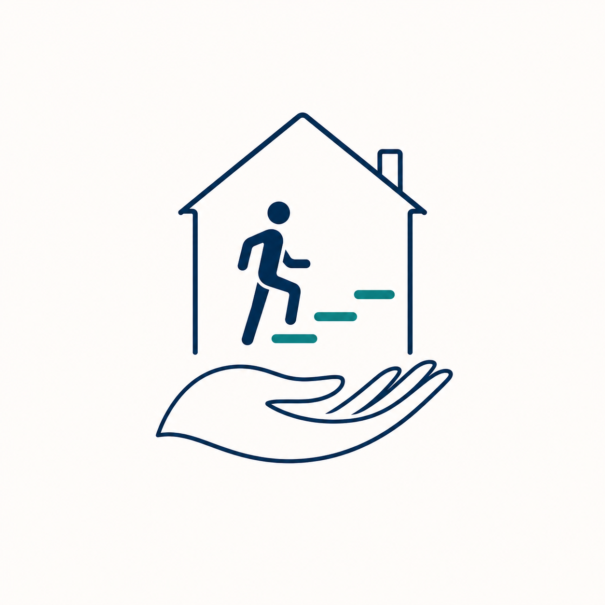

# Supplied Logo Production Cleanup Design

**Date:** 2026-08-03  
**Brand:** Stronger at Home Physiotherapy by Melanie Watsham  
**Status:** Approved design direction; production artwork remains proposed  
**Approval owner for final artwork:** Melanie Watsham

## Objective

Replace the current proposed hybrid symbol with a faithful production reconstruction of the newly supplied square logo image. Preserve its visual concept and composition while removing raster effects and aligning it with the approved brand system. The result remains a horizontal hybrid lockup with the symbol at left and the existing wordmark at right.

## Authoritative Visual Reference

The authoritative reference is:

`docs/superpowers/specs/assets/stronger-at-home-supplied-logo-reference.png`

- Original supplied dimensions: `1254 × 1254` pixels.
- SHA-256: `6d066dbeff88023aece19346a1d0a9a1d3f4577f7846545e359ad59fab24f889`.
- Role: visual reconstruction reference, not production artwork.
- Rights status: supplied by the project sponsor for this brand project; explicit ownership/usage-rights confirmation for this exact image remains a clearance item before public use.

## Approved Direction

The supplied image replaces the earlier proposed filled-hand/doorway symbol as the design master. Production artwork will retain:

- The open-bottom house outline.
- The small chimney on the right roof plane.
- The moving person inside the house.
- Three ascending rounded progression steps.
- The outlined supporting hand below the house.
- The reference image's vertical relationship: home and active progress above, supporting hand below.
- The calm, rounded, approachable visual character.

This choice supersedes the intermediate exploration decisions to remove the chimney, remove the supplied hand, or replace the symbol with an abstract progress path.

## Faithful Production Cleanup

The production reconstruction may regularise edges and curves but must not reinterpret the composition.

| Preserve faithfully | Clean up for production |
|---|---|
| House, chimney, person, steps and hand | Rebuild as editable vector paths |
| Relative placement and overall proportions | Remove glow, blur, shadow and off-white background |
| Moving pose and ascending step direction | Use flat colours with no gradients or transparency effects |
| Open-bottom house and hand below it | Smooth raster artefacts and regularise rounded joins/caps |
| Outlined supporting-hand character | Simplify only imperceptible path noise, not the hand silhouette |

The image-generation model must not be used to recreate or finalise logo geometry. It may not replace deterministic vector reconstruction because it could alter the approved reference.

## Colour and Typography

- Deep Navy `#203E55`: house, chimney, person and hand.
- Warm Sand `#C3A26E`: all three progression steps, replacing the reference teal.
- Pale Sky `#E8F1F6` and Warm Cream `#F7F2E8`: review and holding surfaces only.
- No additional colours, gradients, glow or shadow.
- `Stronger at Home`: Source Serif 4 Semibold.
- `Physiotherapy`: Source Serif 4 Regular.
- `by Melanie Watsham`: Atkinson Hyperlegible Next Semibold.

## Primary Lockup

- Transparent horizontal SVG with the reconstructed symbol at left and the existing three-line wordmark at right.
- Wordmark-led visual hierarchy: the business name must be the first-read element.
- The symbol should occupy approximately one quarter of the total lockup width, with sufficient separation to prevent the hand or roof from crowding the lettering.
- Live wordmark and endorsement text remain editable in the primary source.
- The endorsement must remain legible at the `348px` small-header review size.
- No standalone symbol is approved in Stage 1.

## Accessibility and Small-Size Behaviour

- SVG must include an exact descriptive `<title>` and `<desc>` linked through `aria-labelledby`.
- The primary review must include `1160px`, `580px` and `348px` widths.
- At `348px`, the house, moving person, progression direction and supporting-hand gesture must remain recognisable.
- If the finger detail cannot survive at small size, that is a later compact-variant problem; do not distort the approved primary silhouette to solve it prematurely.

## Provenance and Governance

- Preserve the supplied PNG as an immutable documentation reference with its hash.
- Record the production SVG's exact SHA-256 in the artwork manifest.
- Mark the reconstructed primary logo `proposed` with null review metadata until Melanie Watsham explicitly approves the exact artwork.
- Keep the public business name proposed pending clearance.
- Keep HCPC, CSP, AGILE and ATOCP claims verification-gated.
- Do not create compact, monochrome or reversed production variants until the reconstructed primary artwork is approved.

## Validation

Automated validation must reject:

- Embedded raster elements in the production SVG.
- Missing or incorrect accessible title/description.
- Missing live business-name, descriptor or endorsement text.
- Paint colours outside Deep Navy and Warm Sand.
- Manifest path or SHA-256 mismatches.
- Proposed artwork containing review metadata.
- Approved primary artwork without Melanie Watsham and a valid ISO review date.

Visual review must assess:

- Fidelity to the supplied reference.
- House/person/steps/hand hierarchy.
- Wordmark-led balance.
- Finger and person clarity at small size.
- No unintended glow, soft edges or raster artefacts.
- Pale Sky, Warm Cream and Deep Navy holding-surface behaviour.

## Approval Boundary

The design direction is approved by the project sponsor. The reconstructed artwork itself remains proposed. It may advance only after the complete review composition is shown and the user confirms: `Melanie Watsham explicitly approved this exact artwork.`
